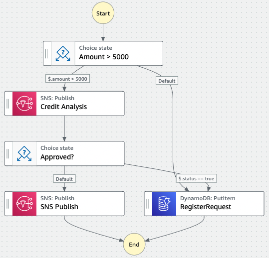

# CLOUD LOAN REQUEST 
The [AWS CloudFormation](https://docs.aws.amazon.com/AWSCloudFormation/latest/UserGuide/Welcome.html) template in this repository describes the infrastructure for a cloud native loan request workflow with [Amazon API Gateway](https://docs.aws.amazon.com/apigateway/latest/developerguide/welcome.html), [AWS Step Functions](https://docs.aws.amazon.com/step-functions/index.html) and [Amazon SNS](https://docs.aws.amazon.com/sns/index.html). 

## Overview
The Figure below depicts the _Loan Request Workflow_. The workflow starts evaluating an amount. There are two paths: (i) _the default path_, when the amount is less than or equals to 5_000; and (ii) _the alternative path_, when the amount is greater than 5_000. 

The _default path_ registers the loan request to a DynamoDB table and ends the workflow. The _alternative path_ sends a message to a SNS topic and pauses the workflow execution till it gets a task token back. 

The message has the amount requested and a token to resume the workflow. When the token is sent back, it also brings a parameter _status_ with one of two possible values: _true_, meaning that the request was accepted, or _false_, meaning that the request was rejected. 

The request is inserted into a DynamoDB table when _status_ == _true_. Otherwise, a message is sent to another SNS topic, informing the rejection.

API Gateway is used three times in the workflow: (i) to start the workflow, carrying a payload with the amount requested; (ii) to accept the loan, resuming the workflow with _status_ == _true_; and (iii) to reject the loan, resuming the workflow with _status_ == _false_. 

## Running the Project
To run the project, follow these steps: 

1. Create a stack using [`loan-request-cf-template.yaml`](loan-request-cf-template.yaml) file;
2. Subscribe your email to both SNS topics;
3. Open the Step functions console to follow the workflow execution;
4. Open the API Gateway console and deploy the API, or use the _test_ feature to try out the project;
5. Submit a POST request to the `loan` resource with a payload like so: {"amount": 3000}
6. Check the the DynamoDB table to see that your loan is registered
7. Submit another POST request to the `loan` resource with a payload like so: {"amount": 6000}
8. Check our email to get the token;
9. Submit a POST request to the `accept` resource with a payload like so: {"amount": 6000, "token": "PASTE_YOUR_TOKEN_HERE"}
10. If you want to reject, send a POST request to the `reject` resource with the same payload, but omitting the "amount".